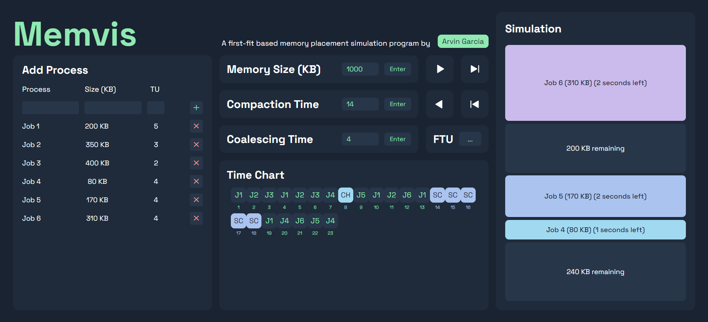

<h1 align="center">
   
  
   
  Memvis
   
</h1>

<h4 align="center">A first-fit based memory placement simulation program.</h4>

## Key Features

* Interactive Memory Visualization
  - Simulate memory allocation and deallocation using dynamic, visual representations of memory blocks.
* First-Fit Allocation Strategy
  - Implements the first-fit memory placement strategy to allocate memory for incoming processes.
* Live Memory Updates 
  - See memory blocks being added, removed, and merged in real-time.
* Time-Based Simulation Control
  - Step through the simulation one action at a time or use auto-forwarding to simulate over a set time interval.
* Dynamic Hole Management
  - Automatically detect and coalesce adjacent holes based on user-defined intervals.
* Storage Compaction
  - Periodically compact memory to merge fragmented free spaces, following a user-defined compaction time.
* Customizable Process Input
  - Add processes with custom sizes and durations.
* Interactive Time Chart
  - Visualize memory events with a time chart showing process additions, time decrements, coalescing holes, and storage compaction.
* Color-Coded Process Blocks
  - Differentiate processes with distinct colors for easy tracking and analysis.

